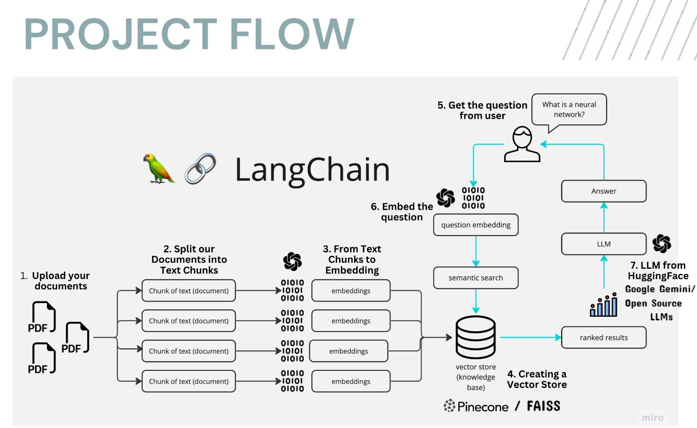

# PDF-GenAI-Agent 📚 Chatbot AI 🤖

Introducing PDF-GenAI-Agent! 🚀 Engage in intelligent conversations with multiple PDFs using Langchain, Google Gemini Pro, and FAISS Vector DB, all seamlessly integrated with Streamlit for easy deployment. Get accurate, real-time responses powered by the open-source Google Gemini language model. 📚💬 Revolutionize your PDF interactions today! 

## 📝 Overview
PDF-GenAI-Agent is a web-based platform built with Streamlit, allowing users to interact with a chatbot. The tool enables users to upload several PDF files, extract the textual content, and use that data to train the chatbot. Users can then have interactive conversations with the AI, which is trained to provide responses based on the content of the uploaded PDFs.


## 💻 Demo:


## 🎯 Workflow:
------------



Here’s how the app processes your queries:

1. **PDF Processing**: The app loads and extracts text from the selected PDFs.

2. **Text Segmentation**: The extracted content is split into smaller, manageable chunks for more efficient processing.

3. **Language Model Integration**: A language model is employed to create vector embeddings for each text chunk.

4. **Similarity Matching**: When a question is posed, the app matches it with the most semantically relevant text chunks.

5. **Response Generation**: The selected chunks are processed by the language model, which generates a response based on the content from the PDFs.


---
## 🎯 Key Features

- **Dynamic Chunking**: Utilizing the Sliding Window Chunking method, this technique adapts its window size and position to optimize data access, ensuring an effective balance between detailed and broad information extraction.

- **Multi-Document QA**: Enables users to ask both simple and complex queries across various documents simultaneously, overcoming the constraints of single-document systems.

- **File Format Support**: Compatible with both PDF and TXT files.

- **Language Model Compatibility**: Supports several models, including Google Gemini Pro, OpenAI GPT-3, Anthropic Claude, Llama2, and other open-source LLMs.


## 🌟 Dependencies

- **Streamlit**: A Python library for creating web apps with interactive elements.
- **google-generativeai**: A package enabling generative AI features for chatbots and virtual assistants, ideal for content creation, summarization, dialogue agents, and more.
- **python-dotenv**: A library for managing environment variables from a .env file, commonly used to store sensitive information like API keys.
- **langchain**: A custom library designed for tasks in natural language processing, such as text chunking, embedding generation, and conversational models.
- **PyPDF2**: A Python library for working with PDF files, supporting operations like merging, splitting, and text extraction.
- **faiss-cpu**: Developed by Facebook, FAISS is used for similarity search, machine learning embeddings, and clustering of dense vectors.
- **langchain_google_genai**: An integration tool between LangChain and Google's generative-ai SDK, facilitating embedding generation for enhanced chatbot interactions.


---

## ▶️ Installation

Clone the repository:

## ▶️Installation

Clone the repository:

Install the required Python packages:

`pip install -r requirements.txt`

Set up your Google API key from `https://makersuite.google.com/app/apikey` by creating a .env file in the root directory of the project with the following contents:

`GOOGLE_API_KEY =<your-api-key-here>`

Run the Streamlit app:

`streamlit run app.py`

---
## 💡Usage

run app, fork app and follow the below steps to start using it. Use the sidebar to upload PDF files and train the chatbot. Once trained, you can have conversations with the chatbot by entering questions in the text input field.

In case You want to run & implement project on your system then follow these steps:

1. Ensure that you have installed the required dependencies and added the **Google API key to the `.env` file** (MUST).
2. Run the `app.py` file using the Streamlit CLI. Execute the following command:
   ```
   streamlit run app.py
   ```
3. The application will launch in your default web browser, displaying the user interface.
4. Upload multiple PDF documents into the app by following the provided instructions at sidebar. On the sidebar, you'll find an option to upload PDF documents. Click on the "Upload your documents here and click on Process" button and select one or more PDF files. 
5. Don't forget to click on Submit & Process Button.
6. Ask questions in natural language about the loaded PDFs using the chat interface.
7. Chatting with the Documents: After uploading and processing the PDF documents, you can ask questions by typing them in the text input field. Press Enter or click the "Ask" button to submit your question.

The application will use conversational AI to provide responses based on the content of the uploaded documents. The responses will be displayed in the chat interface.
